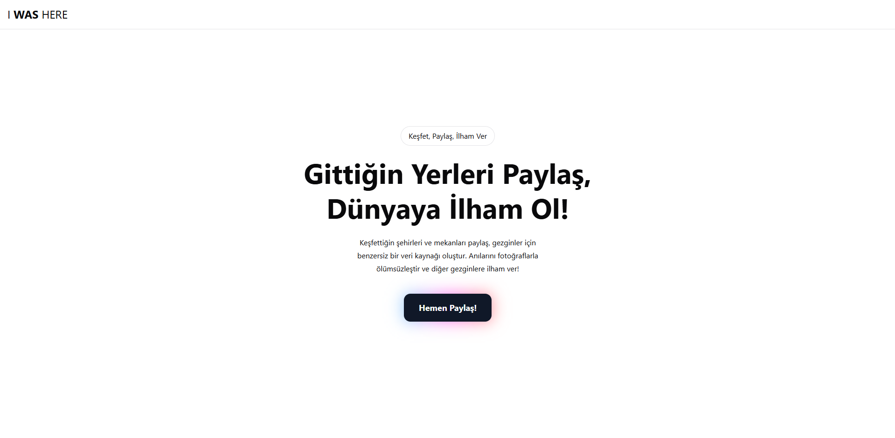
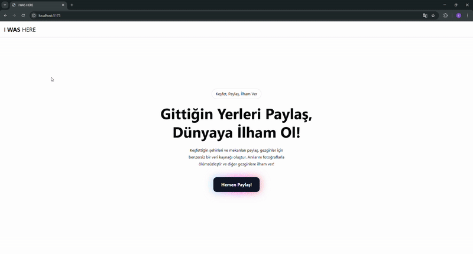

# Form Stepper Example



Form adımlama yapısını yönetmek için geliştirilmiş modern ve şık bir React uygulaması.

Bu proje, **I WAS HERE** projesinin frontend tarafının ilk halidir. **I WAS HERE**, insanların gittikleri yerleri bizimle paylaşarak bir veri seti oluşturmamıza yardımcı olan bir projedir. Kullanıcılardan gittikleri yerlerin fotoğraflarını isteyerek bir veri seti oluşturmayı amaçlamaktadır. Bu repo, form stepper yapısını göstermek için oluşturulmuştur.

## 🚀 Teknolojiler

Bu proje aşağıdaki teknolojileri kullanarak geliştirilmiştir:

- ⚡ **React** – Kullanıcı arayüzü için
- ⚡ **Vite** – Hızlı geliştirme ortamı için
- ⚡ **TypeScript** – Tip güvenliği için
- 🎨 **TailwindCSS** – Esnek ve modern tasarım için
- 🎨 **shadcn/ui** – Önceden hazırlanmış UI bileşenleri için
- ✅ **Formik** – Form yönetimi için
- ✅ **Yup** – Form doğrulama için
- 🔀 **React Router DOM** – Sayfa yönlendirmeleri için

## 📸 Önizleme



## 📦 Kurulum

Projeyi çalıştırmak için aşağıdaki adımları takip edebilirsin:

```bash
git clone https://github.com/enesgkky/form-stepper-example.git
cd form-stepper-example
yarn install # veya npm install
yarn dev # veya npm run dev
```

## 🛠️ Özellikler

✅ Adım adım form yönetimi (Stepper yapısı)  
✅ Dinamik doğrulama kuralları (Formik & Yup)  
✅ Modern ve şık UI bileşenleri  
✅ Hızlı ve optimize geliştirme (Vite)  
✅ TailwindCSS ile özelleştirilebilir tema  
✅ Sayfa yönlendirmeleri için React Router DOM

## 📝 Kullanım

Form, belirli adımlara göre ilerler ve her adımda farklı doğrulama kurallarını uygular.  
Örneğin, **4. adımda dosya yükleme zorunlu hale gelir.**

```ts
import * as Yup from "yup";

export const formValidation = Yup.object().shape({

  /*
   * @param step: number
   * Step'i normalde schema'da tanımlamamıza gerek yok ama when fonksiyonu
   * ile step'e göre validasyon yapacağımız için tanımlıyoruz.
   */

  step: Yup.number().required(),

  // Step 1
  firstName: Yup.string().when("step", {
    is: 1,
    then: (schema) => schema.required("Name is required"),
  }),

  surname: Yup.string().when("step", {
    is: 1,
    then: (schema) => schema.required("Surname is required"),
  }),

  // Step 2
  age: Yup.string().when("step", {
    is: 2,
    then: (schema) => schema.required("Age is required"),
  }),
  gender: Yup.string().when("step", {
    is: 2,
    then: (schema) => schema.required("Gender is required"),
  }),

  // Step 3
  job: Yup.string().when("step", {
    is: 3,
    then: (schema) => schema.required("Job is required"),
  }),
  socialLink: Yup.string().when("step", {
    is: 3,
    then: (schema) => schema.notRequired().url("Invalid URL"),
  }),
  email: Yup.string().when("step", {
    is: 3,
    then: (schema) =>
      schema.required("Email is required").email("Invalid email"),
  }),

  // Step 4
  location: Yup.string().when("step", {
    is: 4,
    then: (schema) => schema.required("Location is required"),
  }),

  file: Yup.mixed().when("step", {
    is: 4,
    then: (schema) =>
      schema
        .required("Dosya yüklenmesi zorunludur")
        .test(
          "fileSize",
          "Dosya boyutu 2MB geçemez",
          (value: any) => value && value.size <= 2 * 1024 * 1024 // 2MB
        )
        .test(
          "fileType",
          "Sadece .jpg ve .png dosyalarına izin verilir",
          (value: any) =>
            value && ["image/jpeg", "image/png"].includes(value.type)
        ),
    otherwise: (schema) => schema.notRequired(), // Diğer adımlarda zorunlu değil
  }),
});
```

## 🌟 Katkıda Bulunma

Bu projeye katkıda bulunmak isterseniz, **pull request** açabilirsiniz. Hataları bildirmek için [issues](https://github.com/enesgkky/form-stepper-example/issues) sekmesini kullanabilirsiniz.

---

**📌 Repo:** [form-stepper-example](https://github.com/enesgkky/form-stepper-example)  
**🚀 Geliştirici:** [@enesgkky](https://github.com/enesgkky)
